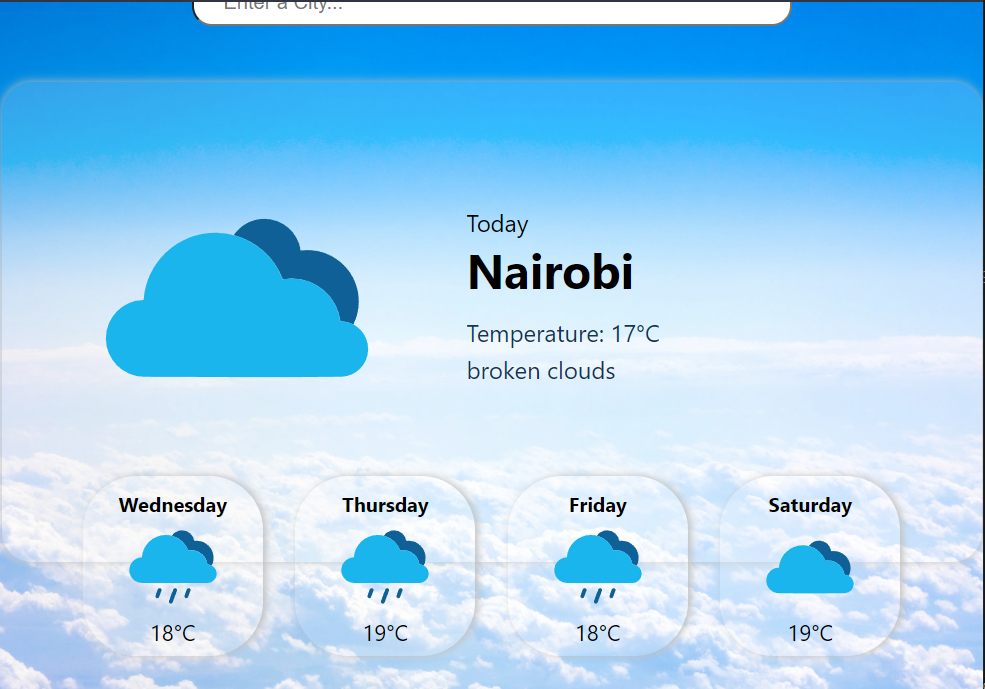

# Weather Web App 

## Description

A simple REACT web app that provides a user interface to retrieve weather forecasts for a selected location for seven days. Requests are sent to the OpenWeatherMap API to the retrieve the information.

## Installation

Use either of the following commands:

    npm run start

or 

    yarn run start

## Technologies Used

- React
- CSS3
- HTML5
- OpenWeatherMap API
